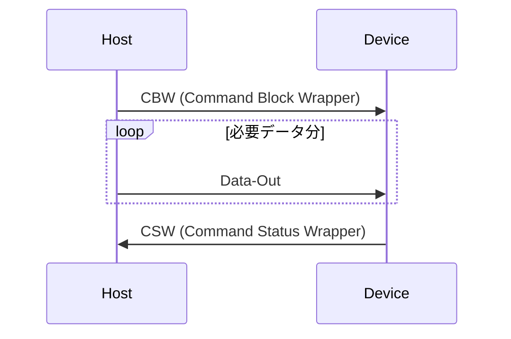
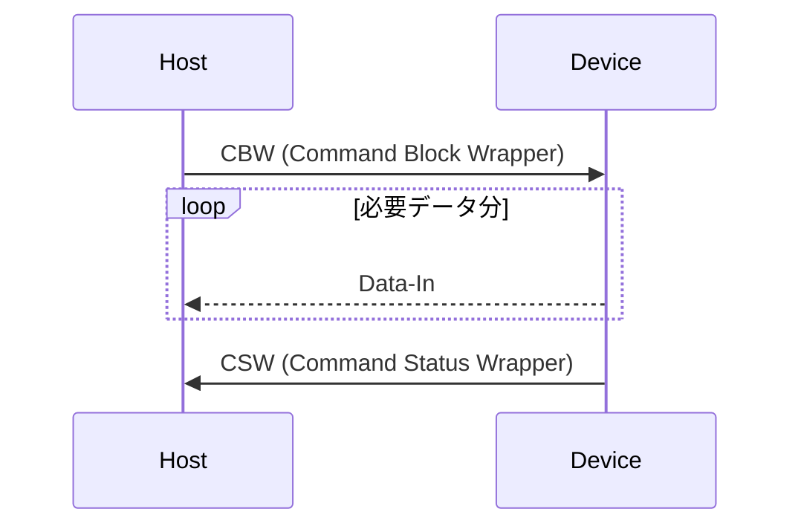
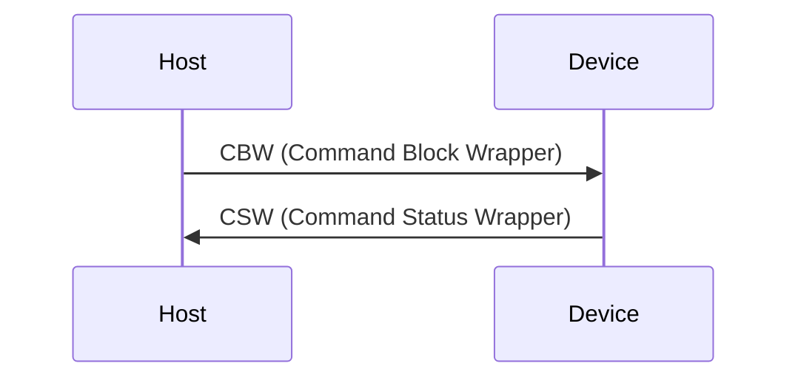

掲題の通り Rust で USB Mass Storage Class (MSC) Bulk-Only Transport を実装した。
RAM 上の値を Disk Drive に見せかけたデバイスとして Windows から認識できるようになったので要所を書き残す。

実装には Rust を使用し、 Raspberry pi pico (rp2040) 上で動作確認を行っている。実装の Framework には [embassy-rs](https://github.com/embassy-rs/embassy) を使用した。

## USB 通信の構成・設定

[Mass Storage Bulk Only 1.0 - usb.org](https://www.usb.org/sites/default/files/usbmassbulk_10.pdf) に基づいて実装する。具体的に以下の通信を行う。

### Descriptor 構成

- USB Device
  - Device Descriptor (MSC Bulk Only Transport)
  - Configuration Descriptor
    - Interface Descriptor0 (MSC Bulk Only Transport)
      - Endpoint Descriptor1: Bulk out
      - Endpoint Descriptor2: Bulk in

### USB Mass Storage Class

USB（に限らない話だが）を用いた通信は Host/Device 双方の FW で共通のプロトコル定義に基づいた実装が必要だが、一般的に使われる機能については USB の仕様としてクラス定義されている。
:::message
例: キーボード・マウス等入力デバイス定義 [Device Class Definition for Human Interface Devices(HID)](https://usb.org/sites/default/files/hid1_11.pdf)
:::

今日使われている OS で USB が使える環境にあれば、Host 側のドライバ実装は多くの場合用意されているので、独自のドライバ作成と署名・インストールの手順を省くことができる。
開発者は Device 側の FW を定義に基づいて実装するだけで良い。

このクラス定義のうち、外付け記憶装置を制御するための 1 つとして MSC がある。

### USB の転送方法

Bulk-only Transfer の前に Bulk 転送について触れておく。USB の転送方法には主に以下の 4 種類があり、用途次第で使い分けられている。

- Control Transfer
  - デバイスの設定・制御・少量のデータ転送を行い場合
- Bulk Transfer
  - 大量のデータを転送する場合
- Interrupt Transfer
  - 定期的、即時通知が必要な場合
- Isochronous Transfer
  - Audio/Video 等リアルタイム性が求められるデータ転送を行う場合

また 1 つの USB Device は論理的に複数の機能をもたせることができる。この分割単位を Interface と呼ぶ。
Interface が実装している機能次第で転送に必要な線路の種類と数が異なっており、この転送の最小単位を EndPoint と呼ぶ。

- Device Descriptor
  - Class/SubClass/Protocol code (次項参照), VID,PID, 製造元、製品名、シリアルナンバーなどデバイス自身の情報
- Configuration Descriptor
  - Interface Descriptor
    - 対象の機能が必要とする通信次第で複数持てる
    - Endpoint Descriptor
      - 転送方法(Control/Bulk/Interrupt/Isochronous) 、転送方向 (IN/OUT)、PacketSize など
      - Interface が必要な Endpoint の数だけ複数持てる

### Bulk-only Transfer

USB のクラス定義は 同じ MSC でもサブクラス、プロトコルで細分化される。
どのような転送方法を使用するか、どのようなコマンドセットで通信するかを設定値 (Device Descriptor) を Host に報告する。

MSC Bulk-only Transfer は太字の設定を報告する。注意点として、Bulk-only transport という名前ではあるが、一部の要求は Control 転送を用いて要求されるのでこれにも反応できる必要がある。
:::message
Class Request と呼ばれ、EndPoint 0 番目 を使用する。 EndPoint 0 は常に Control 転送に固定されているため、Interface Descriptor > Endpoint Descriptor で報告する必要はない。
0 番目に存在するのは、Descriptor 自体の読み取りや初期設定など基本的な通信で使用するため。
:::

- Class
  - **Mass Storage Class**
- SubClass
  - **SubClass: SCSI transport command set**
  - SubClass: ATAPI command set
  - SubClass: UFI (USB Floppy Interface) command set
- Protocol
  - **[Bulk-Only Transport](https://www.usb.org/sites/default/files/usbmassbulk_10.pdf)**
  - [Control/Bulk/Interrupt Transport](https://usb.org/sites/default/files/usb_msc_cbi_1.1.pdf)

## コマンド解釈

### Command/Data/Status Protocol

MSC Bulk-only Transfer は Class Request を除き、Bulk in/out の Endpoint だけを用いて通信を行う。

- Command Block Wrapper (CBW):

  - ホストからデバイスに送信されるコマンドパケットで、デバイスに対して実行するコマンドを指定

    | フィールド名           | サイズ (バイト) | 説明                                                                                 |
    | ---------------------- | --------------- | ------------------------------------------------------------------------------------ |
    | dCBWSignature          | 4               | 固定値 `0x43425355`                                                                  |
    | dCBWTag                | 4               | ホストが設定するタグ。CSW で同じ値を返す                                             |
    | dCBWDataTransferLength | 4               | 転送するデータのバイト数                                                             |
    | bmCBWFlags             | 1               | データ転送の方向 (0x80: DataIn デバイスからホスト, 0x00: DataOut ホストからデバイス) |
    | bCBWLUN                | 1               | 論理ユニット番号 (LUN)                                                               |
    | bCBWCBLength           | 1               | CBWCB の長さ (1〜16 バイト)                                                          |
    | CBWCB                  | 16              | コマンドブロック (SCSI コマンドなど)                                                 |

- DataOut
  - ホストからデバイスに送信されるデータで、書き込むデータなど
- DataIn
  - デバイスからホストに送信されるデータで、読み取ったデータなど
- Command Status Wrapper (CSW)

  - デバイスからホストに送信されるステータスパケットで、実行結果をホストに通知する

    | フィールド名    | サイズ (バイト) | 説明                                                           |
    | --------------- | --------------- | -------------------------------------------------------------- |
    | dCSWSignature   | 4               | 固定値 `0x53425355`                                            |
    | dCSWTag         | 4               | 対応する CBW の dCBWTag と同じ値                               |
    | dCSWDataResidue | 4               | 実際に転送されたデータ量と期待されたデータ量の差               |
    | bCSWStatus      | 1               | コマンドの実行結果 (0x00: 成功, 0x01: 失敗, 0x02: Phase Error) |

CBW は以下のようなフォーマットとなっており、CBWCD に本命のコマンドが各王されている。

DataOut が必要な場合、DataIn が必要な場合、どちらも不要な場合で以下のようなやり取りとなる。

#### DataOut が必要なコマンド (Write 等)

#### DataIn が必要なコマンド (Read 等)

#### DataOut/DataIn どちらも不要な場合

### SCSI Command set

usb.org の仕様書を見ていると、CBW/CSW の説明があるが具体的なコマンドセット記述がないことに気がつく。これは SubClass で表明している内容で変化するためである。
[t10.org](https://www.t10.org/drafts.htm), [INCITS.org](https://www.incits.org/) では委員もしくは購入しないと正式なものは見ることができない。

今回は Hobby 用途なので、未実装の CBW をすべてエラー応答しつつ、そのコマンド内容を出力して Windows が要求するコマンドを順に debug print/Wireshark で確認した。
その後、1 次ソースではないが網羅的にコマンドセットの情報が得られる情報をいくつか確認しながら実装を繰り返した。

注意点だが、CBW/CSW 等 USB の仕様に基づく内容は Little Endian だが、SCSI に関わる部分 (CBW Command Block) は Big Endian である。技術的背景によるものだが Parse 時にミスしないように注意したい。

- [SCSI Commands Reference Manual - seagate](https://www.seagate.com/files/staticfiles/support/docs/manual/Interface%20manuals/100293068j.pdf)
- [SCSI Reference - IBM TS3500 Tape Library](https://www.ibm.com/docs/en/ts3500-tape-library?topic=reference-scsi)
- [Storagetek SL150 Modular Tape Library - Oracle](https://docs.oracle.com/en/storage/tape-storage/storagetek-sl150-modular-tape-library/index.html)
- [AN2554 Creating a Multi-LUN USB Mass Storage Class Device Using the MPLAB Harmony USB Device Stack - Microchip](https://ww1.microchip.com/downloads/aemDocuments/documents/OTH/ApplicationNotes/ApplicationNotes/00002554A.pdf)
  - セットすべきフィールドに悩んだときに以下を見つけて助かりました
  - [How to make a USB Mass Storage Device part 1](https://aidanmocke.com/blog/2020/12/30/USB-MSD-1/)

順に実装したコマンドとその要点

- Test Unit Ready
  - デバイスの準備完了を確認するコマンド。特別 Setup に時間がかかる処理がなければ CSW だ成功応答
- Request Sense
  - 前回のコマンドでエラーが起きた場合に、そのエラー詳細を収集するためのコマンド
  - 実装上は前回のコマンドの結果を持っておき、エラーがあった場合は対応するエラー内容を Host に送信後、CSW で成功応答
  - エラー内容は Sense Key, Additional Sense Code (ASC), Additional Sense Code Qualifier (ASCQ) で分類したものを通知する [参考: Oracle の docs](https://docs.oracle.com/en/storage/tape-storage/storagetek-sl150-modular-tape-library/slorm/request-sense-03h.html#GUID-9309F2C0-ABF8-470E-AE25-E9535C821B39)
    - 例えば、未実装のコマンドを不正扱いで応答するなら Sense Key = 0x05 (llegal Request), ASC/ASCQ = 0x20/0x00 (Invalid Command)
- Inquiry
  - SCSI Device の基本情報を取得するコマンド。Device Descriptor と同じく本デバイス固有の情報を Host に送信してから CSW で成功応答
  - Removable Media Bit (RMB): リムーバブルディスクメディアサポート。1 に設定
  - Version: 準拠している SCSI のバージョン。AN2554 に倣って 4
  - Response Data Format (RDF): 応答データのフォーマットバージョイン。AN2554 に倣って 2
  - Vendor Identification/Product Identification/Product Revision Level: 固有の情報を設定
- Read Format Capacities
  - サポートする容量を返す。リスト数は 1 で、RAM 上に配置したデータを Logical Block Size (512byte) で割った Block 数で返す
  - Capacity List Length: 1
  - Number of Blocks: サポートする総 Byte 数 / 512byte
  - Descriptor Code: 2=Formatted media
  - Block Length: 512byte
- ReadCapacity (10)
  - Read Format Capacities と似ているが前者はサポート可能なフォーマット一覧。ReadCapacity は現在のデバイスの総容量とブロックサイズを取得する
  - Last Logical Block Address: サポートする範囲の最後の LBA。 **Read Format Capacities の Number of Blocks - 1 になる点に注意**
  - Block Length: 512byte
- Mode Sense (6)
  - 現在の設定や動作モードを取得するコマンド。可変長だったため AN2554 を参考に最小限の内容を応答
  - Mode Data Length: 3byte (Block Descriptors/Mode Pages なし)
  - Medium Type: 0
  - Device-Specific Parameter: 0
  - Block Descriptor Length: 0
- Prevent/Allow Medium Removal
  - リムーバブルディスクを誤って取り外さないように、外してよいかを Host から通知するコマンド
  - 今回は外すものはないのでコマンドにある Prevent は無視して CSW で応答
- Read (10)
  - コマンドに指定された Logical Block Address (LBA) から Transfer Length 分のデータを Host に送信してから CSW で成功応答
  - 今回使用している Raspberry pi pico は USB Full Speed のため、USB Max Packet size が 64byte のため、1LBA あたり `512byte/64byte=8回` 転送を行う
    - **一度に 512byte 転送しようとしたら embassy-usb 内部で Endpoint Error 扱いになってハマった**
- Write (10)
  - コマンドに指定された Logical Block Address (LBA) から Transfer Length 分のデータが Host から送信されるので、内部のデータを順に更新してから CSW で成功応答
  - Read (10) と同様に 64byte に分割されてくるので逐次適用するか、Logical block Size 分集めてから適用する
