掲題の通り Rust で USB Mass Storage Class (MSC) Bulk-Only Transport を実装した。
RAM 上の値を Disk Drive に見せかけたデバイスとして Windows から認識できるようになったので要所を書き残す。

実装には Rust を使用し、 Raspberry pi pico (rp2040) 上で動作確認を行っている。実装の Framework には [embassy-rs](https://github.com/embassy-rs/embassy) を使用した。

## USB 通信の構成・設定

[Mass Storage Bulk Only 1.0 - usb.org](https://www.usb.org/sites/default/files/usbmassbulk_10.pdf) に基づいて実装する。具体的に以下の通信を行う。


### Descriptor 構成

- USB Device
  - Device Descriptor (MSC Bulk Only Transport)
  - Configuration Descriptor
    - Interface Descriptor0 (MSC Bulk Only Transport)
      - Endpoint Descriptor1: Bulk out
      - Endpoint Descriptor2: Bulk in

### USB Mass Storage Class

USB（に限らない話だが）を用いた通信は Host/Device 双方の FW で共通のプロトコル定義に基づいた実装が必要だが、一般的に使われる機能については USB の仕様としてクラス定義されている。
:::message
例: キーボード・マウス等入力デバイス定義 [Device Class Definition for Human Interface Devices(HID)](https://usb.org/sites/default/files/hid1_11.pdf)
:::

今日使われている OS で USB が使える環境にあれば、Host 側のドライバ実装は多くの場合用意されているので、独自のドライバ作成と署名・インストールの手順を省くことができる。
開発者は Device 側の FW を定義に基づいて実装するだけで良い。

このクラス定義のうち、外付け記憶装置を制御するための 1 つとして MSC がある。

### USB の転送方法

Bulk-only Transfer の前に Bulk 転送について触れておく。USB の転送方法には主に以下の 4 種類があり、用途次第で使い分けられている。

- Control Transfer
  - デバイスの設定・制御・少量のデータ転送を行い場合
- Bulk Transfer
  - 大量のデータを転送する場合
- Interrupt Transfer
  - 定期的、即時通知が必要な場合
- Isochronous Transfer
  - Audio/Video 等リアルタイム性が求められるデータ転送を行う場合

また 1 つの USB Device は論理的に複数の機能をもたせることができる。この分割単位を Interface と呼ぶ。
Interface が実装している機能次第で転送に必要な線路の種類と数が異なっており、この転送の最小単位を EndPoint と呼ぶ。

- Device Descriptor
  - Class/SubClass/Protocol code (次項参照), VID,PID, 製造元、製品名、シリアルナンバーなどデバイス自身の情報
- Configuration Descriptor
  - Interface Descriptor
    - 対象の機能が必要とする通信次第で複数持てる
    - Endpoint Descriptor
      - 転送方法(Control/Bulk/Interrupt/Isochronous) 、転送方向 (IN/OUT)、PacketSize など
      - Interface が必要な Endpoint の数だけ複数持てる

### Bulk-only Transfer

USB のクラス定義は 同じ MSC でもサブクラス、プロトコルで細分化される。
どのような転送方法を使用するか、どのようなコマンドセットで通信するかを設定値 (Device Descriptor) を Host に報告する。

MSC Bulk-only Transfer は太字の設定を報告する。注意点として、Bulk-only transport という名前ではあるが、一部の要求は Control 転送を用いて要求されるのでこれにも反応できる必要がある。
:::message
Class Request と呼ばれ、EndPoint 0 番目 を使用する。 EndPoint 0 は常に Control 転送に固定されているため、Interface Descriptor > Endpoint Descriptor で報告する必要はない。
0 番目に存在するのは、Descriptor 自体の読み取りや初期設定など基本的な通信で使用するため。
:::

- Class
  - **Mass Storage Class**
- SubClass
  - **SubClass: SCSI transport command set**
  - SubClass: ATAPI command set
  - SubClass: UFI (USB Floppy Interface) command set
- Protocol
  - **[Bulk-Only Transport](https://www.usb.org/sites/default/files/usbmassbulk_10.pdf)**
  - [Control/Bulk/Interrupt Transport](https://usb.org/sites/default/files/usb_msc_cbi_1.1.pdf)

## コマンド解釈

### Command/Data/Status Protocol

MSC Bulk-only Transfer は Class Request を除き、Bulk in/out の Endpoint だけを用いて通信を行う。

- Command Block Wrapper (CBW):

  - ホストからデバイスに送信されるコマンドパケットで、デバイスに対して実行するコマンドを指定
  - CBW は以下のようなフォーマットとなっており、CBWCD に本命のコマンドが格納されている。

    | フィールド名           | サイズ (バイト) | 説明                                                                                 |
    | ---------------------- | --------------- | ------------------------------------------------------------------------------------ |
    | dCBWSignature          | 4               | 固定値 `0x43425355`                                                                  |
    | dCBWTag                | 4               | ホストが設定するタグ。CSW で同じ値を返す                                             |
    | dCBWDataTransferLength | 4               | 転送するデータのバイト数                                                             |
    | bmCBWFlags             | 1               | データ転送の方向 (0x80: DataIn デバイスからホスト, 0x00: DataOut ホストからデバイス) |
    | bCBWLUN                | 1               | 論理ユニット番号 (LUN)                                                               |
    | bCBWCBLength           | 1               | CBWCB の長さ (1〜16 バイト)                                                          |
    | CBWCB                  | 16              | コマンドブロック (SCSI コマンドなど)                                                 |

- DataOut
  - ホストからデバイスに送信されるデータで、書き込むデータなど
- DataIn
  - デバイスからホストに送信されるデータで、読み取ったデータなど
- Command Status Wrapper (CSW)

  - デバイスからホストに送信されるステータスパケットで、実行結果をホストに通知する

    | フィールド名    | サイズ (バイト) | 説明                                                           |
    | --------------- | --------------- | -------------------------------------------------------------- |
    | dCSWSignature   | 4               | 固定値 `0x53425355`                                            |
    | dCSWTag         | 4               | 対応する CBW の dCBWTag と同じ値                               |
    | dCSWDataResidue | 4               | 実際に転送されたデータ量と期待されたデータ量の差               |
    | bCSWStatus      | 1               | コマンドの実行結果 (0x00: 成功, 0x01: 失敗, 0x02: Phase Error) |

DataOut が必要な場合、DataIn が必要な場合、どちらも不要な場合の 3 パターンが有り、以下のようなやり取りとなる。

#### DataOut が必要なコマンド (Write 等)

```mermaid
sequenceDiagram
    participant Host
    participant Device

    Host->>Device: CBW (Command Block Wrapper)
    loop 必要データ分
      Host->>Device: Data-Out
    end

    Device->>Host: CSW (Command Status Wrapper)
```



#### DataIn が必要なコマンド (Read 等)

```mermaid
sequenceDiagram
    participant Host
    participant Device

    Host->>Device: CBW (Command Block Wrapper)
    loop 必要データ分
      Device-->>Host: Data-In
    end

    Device->>Host: CSW (Command Status Wrapper)
```



#### DataOut/DataIn どちらも不要な場合


### SCSI Command set

usb.org の仕様書を見ていると、CBW/CSW の説明があるが具体的なコマンドセット記述がないことに気がつく。これは SubClass で表明している内容で変化するためである。
今回の場合 SCSI transport command set がこれに当たるが、 残念ながら [t10.org](https://www.t10.org/drafts.htm), [INCITS.org](https://www.incits.org/) は委員もしくは購入しないと正式なものは見ることができない。

今回は Hobby 用途なので、未実装の CBW をすべてエラー応答しつつ、そのコマンド内容を出力して Windows が要求するコマンドを順に debug print/Wireshark で確認した。
その後、1 次ソースではないが網羅的にコマンドセットの情報が得られる情報をいくつか確認しながら実装を繰り返した。

注意点だが、CBW/CSW 等 USB の仕様に基づく内容は Little Endian だが、SCSI に関わる部分 (CBWCB を Parse するときの Format) は Big Endian である。技術的背景によるものだが Parse 時にミスしないように注意したい。

- [SCSI Commands Reference Manual - seagate](https://www.seagate.com/files/staticfiles/support/docs/manual/Interface%20manuals/100293068j.pdf)
- [SCSI Reference - IBM TS3500 Tape Library](https://www.ibm.com/docs/en/ts3500-tape-library?topic=reference-scsi)
- [Storagetek SL150 Modular Tape Library - Oracle](https://docs.oracle.com/en/storage/tape-storage/storagetek-sl150-modular-tape-library/index.html)
- [AN2554 Creating a Multi-LUN USB Mass Storage Class Device Using the MPLAB Harmony USB Device Stack - Microchip](https://ww1.microchip.com/downloads/aemDocuments/documents/OTH/ApplicationNotes/ApplicationNotes/00002554A.pdf)
  - セットすべきフィールドに悩んだときに以下を見つけて助かりました
  - [How to make a USB Mass Storage Device part 1](https://aidanmocke.com/blog/2020/12/30/USB-MSD-1/)

順に実装したコマンドとその要点

- Test Unit Ready
  - デバイスの準備完了を確認するコマンド。特別 Setup に時間がかかる処理がなければ CSW だ成功応答
- Request Sense
  - 前回のコマンドでエラーが起きた場合に、そのエラー詳細を収集するためのコマンド
  - 実装上は前回のコマンドの結果を持っておき、エラーがあった場合は対応するエラー内容を Host に送信後、CSW で成功応答
  - エラー内容は Sense Key, Additional Sense Code (ASC), Additional Sense Code Qualifier (ASCQ) で分類したものを通知する [参考: Oracle の docs](https://docs.oracle.com/en/storage/tape-storage/storagetek-sl150-modular-tape-library/slorm/request-sense-03h.html#GUID-9309F2C0-ABF8-470E-AE25-E9535C821B39)
    - 例えば、未実装のコマンドを不正扱いで応答するなら Sense Key = 0x05 (llegal Request), ASC/ASCQ = 0x20/0x00 (Invalid Command)
- Inquiry
  - SCSI Device の基本情報を取得するコマンド。Device Descriptor と同じく本デバイス固有の情報を Host に送信してから CSW で成功応答
  - Removable Media Bit (RMB): リムーバブルディスクメディアサポート。1 に設定
  - Version: 準拠している SCSI のバージョン。AN2554 に倣って 4
  - Response Data Format (RDF): 応答データのフォーマットバージョイン。AN2554 に倣って 2
  - Vendor Identification/Product Identification/Product Revision Level: 固有の情報を設定
- Read Format Capacities
  - サポートする容量を返す。リスト数は 1 で、RAM 上に配置したデータを Logical Block Size (512byte) で割った Block 数で返す
  - Capacity List Length: 1
  - Number of Blocks: サポートする総 Byte 数 / 512byte
  - Descriptor Code: 2=Formatted media
  - Block Length: 512byte
- ReadCapacity (10)
  - Read Format Capacities と似ているが前者はサポート可能なフォーマット一覧。ReadCapacity は現在のデバイスの総容量とブロックサイズを取得する
  - Last Logical Block Address: サポートする範囲の最後の LBA。 **Read Format Capacities の Number of Blocks - 1 になる点に注意**
  - Block Length: 512byte
- Mode Sense (6)
  - 現在の設定や動作モードを取得するコマンド。可変長だったため AN2554 を参考に最小限の内容を応答
  - Mode Data Length: 3byte (Block Descriptors/Mode Pages なし)
  - Medium Type: 0
  - Device-Specific Parameter: 0
  - Block Descriptor Length: 0
- Prevent/Allow Medium Removal
  - リムーバブルディスクを誤って取り外さないように、外してよいかを Host から通知するコマンド
  - 今回は外すものはないのでコマンドにある Prevent は無視して CSW で応答
- Read (10)
  - コマンドに指定された Logical Block Address (LBA) から Transfer Length 分のデータを Host に送信してから CSW で成功応答
  - 今回使用している Raspberry pi pico は USB Full Speed のため、USB Max Packet size が 64byte のため、1LBA あたり `512byte/64byte=8回` 転送を行う
- Write (10)
  - コマンドに指定された Logical Block Address (LBA) から Transfer Length 分のデータが Host から送信されるので、内部のデータを順に更新してから CSW で成功応答
  - Read (10) と同様に 64byte に分割されてくるので逐次適用するか、Logical block Size 分集めてから適用する

## 実装

embassy が提供している rp2040 向けのサンプルの以下をベースに構築した。

- Control 転送: [usb_raw.rs](https://github.com/embassy-rs/embassy/blob/main/examples/rp/src/bin/usb_raw.rs)
- Bulk 転送: [usb_raw_bulk.rs](https://github.com/embassy-rs/embassy/blob/main/examples/rp/src/bin/usb_raw_bulk.rs)

大まかな実装点

- Control 転送のハンドラ `embassy_usb::Handler` を実装しつつ、BulkIn/BulkOut の Endpoint を持つデバイスとして初期化
- Device Descriptor を MSC Bulk-only Transfer の定義になるよう修正
  - Control 転送と Bulk 転送で異なる Context となるため、Control 転送から Bulk 転送への通知用に Channel を用意
    - Channel: 異なるスレッド間でデータを送受信するための通信線路
- Bulk 転送から Read/Write の実処理は、コード肥大化防止/責務分割のため Channel を用意

### Control 転送

- Get Max LUN: 0 固定応答
- Mass Storage Reset: Channel 経由で Bulk 処理側に通知

:::details 実装抜粋

```rust
/// USB Mass Storage Class Control Handler
/// This handler is used to handle the control requests for the Mass Storage Class.
/// It supports the Mass Storage Reset and Get Max LUN requests.
pub struct MscCtrlHandler<'ch> {
    /// Interface Number
    if_num: InterfaceNumber,
    /// Bulk Transfer Request Sender (for Mass Storage Reset)
    bulk_request_sender: DynamicSender<'ch, BulkTransferRequest>,
}

impl<'ch> Handler for MscCtrlHandler<'ch> {
    fn control_out<'a>(&'a mut self, req: Request, buf: &'a [u8]) -> Option<OutResponse> {
        crate::trace!("Got control_out, request={}, buf={:a}", req, buf);
        None
    }

    /// Respond to DeviceToHost control messages, where the host requests some data from us.
    fn control_in<'a>(&'a mut self, req: Request, buf: &'a mut [u8]) -> Option<InResponse<'a>> {
        crate::trace!("Got control_in, request={}", req);

        // requestType: Class/Interface, host->device
        // request: 0xff (Mass Storage Reset), 0xfe (Get Max LUN)

        if req.request_type != RequestType::Class || req.recipient != Recipient::Interface {
            return None;
        }
        match req.request {
            x if x == ClassSpecificRequest::MassStorageReset as u8 => {
                // Mass Storage Reset
                crate::trace!("Mass Storage Reset");
                match self
                    .bulk_request_sender
                    .try_send(BulkTransferRequest::Reset)
                {
                    Ok(_) => Some(InResponse::Accepted(&buf[..0])),
                    Err(_) => Some(InResponse::Rejected),
                }
            }
            x if x == ClassSpecificRequest::GetMaxLun as u8 && req.length == 1 => {
                // Get Max LUN
                crate::trace!("Get Max LUN");
                buf[0] = 0; // Only one LUN supported
                Some(InResponse::Accepted(&buf[..1]))
            }
            _ => {
                crate::warn!("Unsupported request: {}", req.request);
                Some(InResponse::Rejected)
            }
        }
    }
}
```

:::

### Bulk 転送

- SCSI Command 対応
- Read/Write は Channel 経由でデータ転送を実施
- Control 転送からの Mass Storage Reset を受けたら、現在の処理を一度打ち切って BulkOut EP 待ち合わせから

:::details 実装抜粋

```rust
impl MscBulkHandlerConfig {
    pub fn new(
        vendor_id: [u8; 8],
        product_id: [u8; 16],
        product_revision_level: [u8; 4],
        num_blocks: usize,
        block_size: usize,
    ) -> Self {
        Self {
            vendor_id,
            product_id,
            product_revision_level,
            num_blocks,
            block_size,
        }
    }
}

/// USB Mass Storage Class Bulk Handler
/// This handler is used to handle the bulk transfers for the Mass Storage Class.
pub struct MscBulkHandler<'driver, 'ch, D: Driver<'driver>> {
    /// Bulk Transfer Request Receiver (for Mass Storage Reset)
    ctrl_to_bulk_request_receiver: DynamicReceiver<'ch, BulkTransferRequest>,
    /// Bulk Endpoint Out
    read_ep: Option<<D as Driver<'driver>>::EndpointOut>,
    /// Bulk Endpoint In
    write_ep: Option<<D as Driver<'driver>>::EndpointIn>,

    /// Config
    config: MscBulkHandlerConfig,

    /// Request Read/Write to Internal
    data_request_sender: DynamicSender<'ch, StorageRequest<MscReqTag, USB_LOGICAL_BLOCK_SIZE>>,
    /// Response Read/Write from Internal
    data_response_receiver:
        DynamicReceiver<'ch, StorageResponse<MscReqTag, USB_LOGICAL_BLOCK_SIZE>>,
}

impl<'driver, 'ch, D: Driver<'driver>> MscBulkHandler<'driver, 'ch, D> {
    pub fn new(
        config: MscBulkHandlerConfig,
        ctrl_to_bulk_request_receiver: DynamicReceiver<'ch, BulkTransferRequest>,
        data_request_sender: DynamicSender<'ch, StorageRequest<MscReqTag, USB_LOGICAL_BLOCK_SIZE>>,
        data_response_receiver: DynamicReceiver<
            'ch,
            StorageResponse<MscReqTag, USB_LOGICAL_BLOCK_SIZE>,
        >,
    ) -> Self {
        Self {
            read_ep: None,
            write_ep: None,
            config,
            ctrl_to_bulk_request_receiver,
            data_request_sender,
            data_response_receiver,
        }
    }

    /// Handle response for simple command
    async fn handle_response_single<'a>(
        write_ep: &'a mut <D as Driver<'driver>>::EndpointIn,
        status: CommandBlockStatus,
        write_data: Option<&'a [u8]>,
        cbw_packet: &'a CommandBlockWrapperPacket,
        csw_packet: &'a mut CommandStatusWrapperPacket,
    ) -> Result<(), EndpointError> {
        if let Some(data) = write_data {
            // transfer data
            write_ep.write(data).await?;
            // update csw_packet.data_residue
            if data.len() < cbw_packet.data_transfer_length as usize {
                csw_packet.data_residue =
                    (cbw_packet.data_transfer_length as usize - data.len()) as u32;
            }
        }
        // update csw_packet
        csw_packet.status = status;

        // Status Transport
        let csw_data = csw_packet.to_data();
        crate::trace!("Send CSW: {:#x}", csw_packet);
        write_ep.write(&csw_data).await?;

        Ok(())
    }

    /// Main loop for bulk-only transport
    pub async fn run(&mut self) -> ! {
        crate::assert!(self.read_ep.is_some());
        crate::assert!(self.write_ep.is_some());
        let read_ep = self.read_ep.as_mut().unwrap();
        let write_ep = self.write_ep.as_mut().unwrap();
        'main_loop: loop {
            // EndPoint有効待ち
            read_ep.wait_enabled().await;
            crate::trace!("Connected");

            // Request Sense CommandでError reportingが必要なので、前回の情報を保持しておく
            let mut latest_sense_data: Option<RequestSenseData> = None;
            // Phase Error時の対応用
            let mut phase_error_tag: Option<u32> = None;

            'read_ep_loop: loop {
                // Check if Mass Storage Reset occurred
                if (self.ctrl_to_bulk_request_receiver.try_receive()
                    == Ok(BulkTransferRequest::Reset))
                {
                    crate::trace!("Mass Storage Reset");
                    phase_error_tag = None;
                    break 'read_ep_loop;
                }

                // clear latest sense data
                latest_sense_data = None;

                // Command Transport
                let mut read_buf = [0u8; USB_LOGICAL_BLOCK_SIZE]; // read buffer分確保
                let Ok(read_cbw_size) = read_ep.read(&mut read_buf).await else {
                    crate::error!("Read EP Error (CBW)");
                    phase_error_tag = None; // unknown tag
                    latest_sense_data = Some(RequestSenseData::from(
                        SenseKey::IllegalRequest,
                        AdditionalSenseCodeType::IllegalRequestInvalidCommand,
                    ));
                    break 'read_ep_loop;
                };
                let Some(cbw_packet) = CommandBlockWrapperPacket::from_data(&read_buf) else {
                    crate::error!("Invalid CBW: {:#x}", read_buf);
                    phase_error_tag = None; // unknown tag
                    latest_sense_data = Some(RequestSenseData::from(
                        SenseKey::IllegalRequest,
                        AdditionalSenseCodeType::IllegalRequestInvalidCommand,
                    ));
                    break 'read_ep_loop;
                };
                if !cbw_packet.is_valid_signature() {
                    crate::error!("Invalid CBW signature: {:#x}", cbw_packet);
                    phase_error_tag = None; // unknown tag
                    latest_sense_data = Some(RequestSenseData::from(
                        SenseKey::IllegalRequest,
                        AdditionalSenseCodeType::IllegalRequestInParameters,
                    ));
                    break 'read_ep_loop;
                };
                if cbw_packet.command_length == 0 {
                    crate::error!("Invalid CBW command length: {:#x}", cbw_packet);
                    phase_error_tag = None; // unknown tag
                    latest_sense_data = Some(RequestSenseData::from(
                        SenseKey::IllegalRequest,
                        AdditionalSenseCodeType::IllegalRequestInParameters,
                    ));
                    break 'read_ep_loop;
                };

                // Prepare CSW
                let mut csw_packet = CommandStatusWrapperPacket::new();
                csw_packet.tag = cbw_packet.tag;
                csw_packet.data_residue = 0;
                csw_packet.status = CommandBlockStatus::CommandPassed;

                // Parse SCSI Command
                let scsi_commands = cbw_packet.get_commands();
                let scsi_command = scsi_commands[0];
                // コマンドごとに処理
                let send_resp_status: Result<(), EndpointError> = match scsi_command {
                    x if x == ScsiCommand::TestUnitReady as u8 => {
                        crate::trace!("Test Unit Ready");
                        // カードの抜き差しなどはないので問題無しで応答
                        Self::handle_response_single(
                            write_ep,
                            CommandBlockStatus::CommandPassed,
                            None,
                            &cbw_packet,
                            &mut csw_packet,
                        )
                        .await
                    }
                    x if x == ScsiCommand::Inquiry as u8 => {
                        crate::trace!("Inquiry");
                        // Inquiry data. resp fixed data
                        let inquiry_data = InquiryCommandData::new(
                            self.config.vendor_id,
                            self.config.product_id,
                            self.config.product_revision_level,
                        );

                        let mut write_data = [0u8; INQUIRY_COMMAND_DATA_SIZE];
                        inquiry_data.prepare_to_buf(&mut write_data);
                        Self::handle_response_single(
                            write_ep,
                            CommandBlockStatus::CommandPassed,
                            Some(&write_data),
                            &cbw_packet,
                            &mut csw_packet,
                        )
                        .await
                    }
                    x if x == ScsiCommand::ReadFormatCapacities as u8 => {
                        crate::trace!("Read Format Capacities");
                        // Read Format Capacities data. resp fixed data
                        let read_format_capacities_data = ReadFormatCapacitiesData::new(
                            self.config.num_blocks as u32,
                            self.config.block_size as u32,
                        );

                        let mut write_data = [0u8; READ_FORMAT_CAPACITIES_DATA_SIZE];
                        read_format_capacities_data.prepare_to_buf(&mut write_data);
                        Self::handle_response_single(
                            write_ep,
                            CommandBlockStatus::CommandPassed,
                            Some(&write_data),
                            &cbw_packet,
                            &mut csw_packet,
                        )
                        .await
                    }
                    x if x == ScsiCommand::ReadCapacity as u8 => {
                        crate::trace!("Read Capacity");
                        // Read Capacity data. resp fixed data
                        let read_capacity_data = ReadCapacityData::new(
                            (self.config.num_blocks - 1) as u32,
                            self.config.block_size as u32,
                        );

                        let mut write_data = [0u8; READ_CAPACITY_16_DATA_SIZE];
                        read_capacity_data.prepare_to_buf(&mut write_data);
                        Self::handle_response_single(
                            write_ep,
                            CommandBlockStatus::CommandPassed,
                            Some(&write_data),
                            &cbw_packet,
                            &mut csw_packet,
                        )
                        .await
                    }
                    x if x == ScsiCommand::ModeSense6 as u8 => {
                        crate::trace!("Mode Sense 6");
                        // Mode Sense 6 data. resp fixed data
                        let mode_sense_data = ModeSense6Data::new();

                        let mut write_data = [0u8; MODE_SENSE_6_DATA_SIZE];
                        mode_sense_data.prepare_to_buf(&mut write_data);
                        Self::handle_response_single(
                            write_ep,
                            CommandBlockStatus::CommandPassed,
                            Some(&write_data),
                            &cbw_packet,
                            &mut csw_packet,
                        )
                        .await
                    }
                    x if x == ScsiCommand::RequestSense as u8 => {
                        // Error reporting
                        if latest_sense_data.is_none() {
                            latest_sense_data = Some(RequestSenseData::from(
                                SenseKey::NoSense,
                                AdditionalSenseCodeType::NoAdditionalSenseInformation,
                            ));
                        }
                        crate::trace!("Request Sense Data: {:#x}", latest_sense_data.unwrap());

                        let mut write_data = [0u8; REQUEST_SENSE_DATA_SIZE];
                        latest_sense_data.unwrap().prepare_to_buf(&mut write_data);
                        Self::handle_response_single(
                            write_ep,
                            CommandBlockStatus::CommandPassed,
                            Some(&write_data),
                            &cbw_packet,
                            &mut csw_packet,
                        )
                        .await
                    }
                    x if x == ScsiCommand::Read10 as u8 => {
                        // Read 10 data. resp variable data
                        let read10_data = Read10Command::from_data(scsi_commands);
                        crate::trace!("Read 10 Data: {:#x}", read10_data);
                        let transfer_length = read10_data.transfer_length as usize;

                        // TODO: channelに空きがある場合transfer_length分のRequest投げるTaskと、Responseを受け取るTaskのjoinにする
                        for transfer_index in 0..transfer_length {
                            let lba = read10_data.lba as usize + transfer_index;
                            let req_tag = MscReqTag::new(cbw_packet.tag, transfer_index as u32);
                            let req = StorageRequest::read(req_tag, lba);

                            self.data_request_sender.send(req).await;
                            let resp = self.data_response_receiver.receive().await;

                            // Read処理中にRead以外の応答が来た場合は実装不具合
                            if resp.message_id != StorageMsgId::Read {
                                crate::unreachable!("Invalid Response: {:#x}", resp);
                            }
                            // Check if the response is valid
                            if (req_tag != resp.req_tag) {
                                crate::error!("Invalid Response: {:#x}", resp);
                                latest_sense_data = Some(RequestSenseData::from(
                                    SenseKey::HardwareError,
                                    AdditionalSenseCodeType::HardwareErrorEmbeddedSoftware,
                                ));
                            }
                            // Check if there is an error
                            if let Some(error) = resp.meta_data {
                                crate::error!("Invalid Response: {:#x}", resp);
                                latest_sense_data =
                                    Some(RequestSenseData::from_data_request_error(error));
                            }

                            // transfer read data
                            let read_data = resp.data.as_ref();
                            for packet_i in 0..USB_PACKET_COUNT_PER_LOGICAL_BLOCK {
                                let start_index = (packet_i * USB_MAX_PACKET_SIZE);
                                let end_index = ((packet_i + 1) * USB_MAX_PACKET_SIZE);
                                // 範囲がUSB_BLOCK_SIZEを超えないように修正
                                let end_index = end_index.min(USB_LOGICAL_BLOCK_SIZE);

                                // データを取り出して応答
                                let packet_data = &read_data[start_index..end_index];
                                crate::trace!(
                                    "Send Read Data (LBA: {:#x}, TransferIndex: {:#x}, PacketIndex: {:#x}): {:#x}",
                                    lba, transfer_index, packet_i, packet_data
                                );
                                let Ok(write_resp) = write_ep.write(packet_data).await else {
                                    crate::error!("Write EP Error (Read 10)");
                                    phase_error_tag = Some(cbw_packet.tag);
                                    latest_sense_data = Some(RequestSenseData::from(
                                        SenseKey::IllegalRequest,
                                        AdditionalSenseCodeType::IllegalRequestInvalidCommand,
                                    ));
                                    break 'read_ep_loop;
                                };
                            }
                        }

                        // CSW 応答
                        csw_packet.status =
                            CommandBlockStatus::from_bool(latest_sense_data.is_none());
                        let transfer_bytes = transfer_length * self.config.block_size;
                        if transfer_bytes < cbw_packet.data_transfer_length as usize {
                            csw_packet.data_residue =
                                (cbw_packet.data_transfer_length as usize - transfer_bytes) as u32;
                        }
                        let csw_data = csw_packet.to_data();
                        crate::trace!("Send CSW: {:#x}", csw_packet);
                        write_ep.write(&csw_data).await
                    }
                    x if x == ScsiCommand::Write10 as u8 => {
                        // Write 10 data. resp variable data
                        let write10_data = Write10Command::from_data(scsi_commands);
                        crate::trace!("Write 10 Data: {:#x}", write10_data);
                        let transfer_length = write10_data.transfer_length as usize;

                        for transfer_index in 0..transfer_length {
                            let lba = write10_data.lba as usize + transfer_index;
                            // packet size分のデータを受け取る
                            let req_tag = MscReqTag::new(cbw_packet.tag, transfer_index as u32);
                            let mut req =
                                StorageRequest::write(req_tag, lba, [0u8; USB_LOGICAL_BLOCK_SIZE]);
                            for packet_i in 0..USB_PACKET_COUNT_PER_LOGICAL_BLOCK {
                                let start_index = (packet_i * USB_MAX_PACKET_SIZE);
                                let end_index = ((packet_i + 1) * USB_MAX_PACKET_SIZE);
                                // 範囲がUSB_BLOCK_SIZEを超えないように修正
                                let end_index = end_index.min(USB_LOGICAL_BLOCK_SIZE);

                                // データを受け取る
                                let Ok(read_resp) =
                                    read_ep.read(&mut req.data[start_index..end_index]).await
                                else {
                                    crate::error!("Read EP Error (Write 10)");
                                    phase_error_tag = Some(cbw_packet.tag);
                                    latest_sense_data = Some(RequestSenseData::from(
                                        SenseKey::IllegalRequest,
                                        AdditionalSenseCodeType::IllegalRequestInvalidCommand,
                                    ));
                                    break 'read_ep_loop;
                                };
                            }

                            crate::trace!("Send DataRequest: {:#x}", req);
                            self.data_request_sender.send(req).await;

                            let resp = self.data_response_receiver.receive().await;
                            crate::trace!("Receive DataResponse: {:#x}", resp);

                            // Write処理中にWrite以外の応答が来た場合は実装不具合
                            if resp.message_id != StorageMsgId::Write {
                                crate::unreachable!("Invalid Response: {:#x}", resp);
                            }

                            // Check if the response is valid
                            if (req_tag != resp.req_tag) {
                                crate::error!("Invalid Response: {:#x}", resp);
                                latest_sense_data = Some(RequestSenseData::from(
                                    SenseKey::HardwareError,
                                    AdditionalSenseCodeType::HardwareErrorEmbeddedSoftware,
                                ));
                            }
                            // Check if there is an error
                            if let Some(error) = resp.meta_data {
                                crate::error!("Invalid Response: {:#x}", resp);
                                latest_sense_data =
                                    Some(RequestSenseData::from_data_request_error(error));
                            }
                        }

                        // CSW 応答
                        csw_packet.status =
                            CommandBlockStatus::from_bool(latest_sense_data.is_none());
                        let transfer_bytes = transfer_length * self.config.block_size;
                        if transfer_bytes < cbw_packet.data_transfer_length as usize {
                            csw_packet.data_residue =
                                (cbw_packet.data_transfer_length as usize - transfer_bytes) as u32;
                        }
                        let csw_data = csw_packet.to_data();
                        write_ep.write(&csw_data).await
                    }
                    x if x == ScsiCommand::PreventAllowMediumRemoval as u8 => {
                        crate::trace!("Prevent/Allow Medium Removal");
                        // カードの抜き差しを許可する
                        Self::handle_response_single(
                            write_ep,
                            CommandBlockStatus::CommandPassed,
                            None,
                            &cbw_packet,
                            &mut csw_packet,
                        )
                        .await
                    }
                    _ => {
                        crate::error!("Unsupported Command: {:#x}", scsi_command);
                        // save latest sense data
                        latest_sense_data = Some(RequestSenseData::from(
                            SenseKey::IllegalRequest,
                            AdditionalSenseCodeType::IllegalRequestInvalidCommand,
                        ));

                        Self::handle_response_single(
                            write_ep,
                            CommandBlockStatus::CommandFailed,
                            None,
                            &cbw_packet,
                            &mut csw_packet,
                        )
                        .await
                    }
                };

                // Phase Error時の対応
                if let Err(e) = send_resp_status {
                    crate::error!("Send Response Error: {:?}", e);
                    // Phase Error時の対応用にtagを保持
                    phase_error_tag = Some(cbw_packet.tag);
                    break 'read_ep_loop;
                }
            }

            // CSW で Phase Error を返す
            if let Some(tag) = phase_error_tag {
                crate::error!("Phase Error Tag: {:#x}", tag);
                let mut csw_packet = CommandStatusWrapperPacket::new();
                csw_packet.tag = tag;
                csw_packet.data_residue = 0;
                csw_packet.status = CommandBlockStatus::PhaseError;
                let csw_data = csw_packet.to_data();
                // 失敗してもハンドリング無理
                write_ep.write(&csw_data).await;
            }
            crate::trace!("Disconnected");
        }
    }
}
```

:::

### USB Setup 部分

- Channel 分離の通り Control 転送と Bulk 転送で管理構造を分けている
- 初期化時に Bulk 転送には Endpoint だけを渡している

:::details 実装抜粋

```rust

impl<'ch> MscCtrlHandler<'ch> {
    pub fn new(bulk_request_sender: DynamicSender<'ch, BulkTransferRequest>) -> Self {
        Self {
            if_num: InterfaceNumber(0),
            bulk_request_sender,
        }
    }

    pub fn build<'a, 'driver, D: Driver<'driver>>(
        &'ch mut self,
        builder: &mut Builder<'driver, D>,
        config: Config<'ch>,
        bulk_handler: &'a mut MscBulkHandler<'driver, 'ch, D>,
    ) where
        'ch: 'driver,
    {
        // Bulk Only Transport for Mass Storage
        let mut function = builder.function(
            MSC_INTERFACE_CLASS,
            MSC_INTERFACE_SUBCLASS,
            MSC_INTERFACE_PROTOCOL,
        );
        let mut interface = function.interface();
        let mut alt = interface.alt_setting(
            MSC_INTERFACE_CLASS,
            MSC_INTERFACE_SUBCLASS,
            MSC_INTERFACE_PROTOCOL,
            None,
        );
        bulk_handler.read_ep = Some(alt.endpoint_bulk_out(64));
        bulk_handler.write_ep = Some(alt.endpoint_bulk_in(64));

        drop(function);
        builder.handler(self);
    }
}
```

```rust
/// USB Control Transfer and Bulk Transfer Channel
async fn usb_transport_task(driver: Driver<'static, USB>) {
    // wait for StorageHandler to be ready
    crate::info!("Send StorageRequest(Seup) to StorageHandler");
    let num_blocks = setup_storage_request_response_channel(MscReqTag::new(0xaa995566, 0)).await;

    // Create embassy-usb Config
    crate::info!("Setup USB Ctrl/Bulk Endpoint (num_blocks: {})", num_blocks);
    let mut config = create_usb_config();

    // Create USB Handler
    let mut config_descriptor = [0; 256];
    let mut bos_descriptor = [0; 256];
    let mut msos_descriptor = [0; 256];
    let mut control_buf = [0; 64];

    let mut ctrl_handler = MscCtrlHandler::new(CHANNEL_USB_CTRL_TO_USB_BULK.dyn_sender());
    let mut builder = Builder::new(
        driver,
        config,
        &mut config_descriptor,
        &mut bos_descriptor,
        &mut msos_descriptor,
        &mut control_buf,
    );
    let mut bulk_handler = MscBulkHandler::new(
        MscBulkHandlerConfig::new(
            USB_VENDOR_ID,
            USB_PRODUCT_ID,
            USB_PRODUCT_DEVICE_VERSION,
            num_blocks,
            USB_LOGICAL_BLOCK_SIZE,
        ),
        CHANNEL_USB_CTRL_TO_USB_BULK.dyn_receiver(),
        CHANNEL_USB_BULK_TO_STORAGE_REQUEST.dyn_sender(),
        CHANNEL_STORAGE_RESPONSE_TO_USB_BULK.dyn_receiver(),
    );
    ctrl_handler.build(&mut builder, config, &mut bulk_handler);

    // Run USB Handler
    let mut usb = builder.build();
    let usb_fut = usb.run();
    let bulk_fut = bulk_handler.run();

    join(usb_fut, bulk_fut).await;
}
```

:::

### RAM 上のデータ操作

- Channel 経由で要求された Read/Write 操作を実行
- [tinyusb msc_disk](https://github.com/hathach/tinyusb/blob/master/examples/device/cdc_msc/src/msc_disk.c#L52) のサンプルを参考に、FAT12 Table の内容を RAM 上の初期値に設定

:::details 実装抜粋

```rust
pub struct RamDiskHandler<const LOGICAL_BLOCK_SIZE: usize, const TOTAL_DATA_SIZE: usize> {
    /// Storage on RAM
    data: [u8; TOTAL_DATA_SIZE],
}

impl<const LOGICAL_BLOCK_SIZE: usize, const TOTAL_DATA_SIZE: usize>
    RamDiskHandler<LOGICAL_BLOCK_SIZE, TOTAL_DATA_SIZE>
{
    /// Create a new RamDisk
    pub fn new() -> Self {
        Self {
            data: [0; TOTAL_DATA_SIZE],
        }
    }

    /// Set data to RamDisk
    pub fn set_data<const N: usize>(&mut self, offset_bytes: usize, data: &[u8; N]) {
        self.data[offset_bytes..offset_bytes + N].copy_from_slice(data);
    }

    /// Get data from RamDisk
    pub fn get_data<const N: usize>(&self, offset_bytes: usize) -> &[u8] {
        &self.data[offset_bytes..offset_bytes + N]
    }

    /// Set FAT12 Data to RAM Disk
    /// refs. https://github.com/hathach/tinyusb/blob/master/examples/device/cdc_msc/src/msc_disk.c#L52
    #[rustfmt::skip]
    pub fn set_fat12_sample_data(&mut self) {
        let readme_contents = b"Hello.\n";
        // LBA0: MBR
        self.set_data(
            0,
            &[
            /// |  0|    1|    2|    3|    4|    5|    6|    7|    8|    9|  0xa| 0xb|  0xc|  0xd|  0xe|  0xf|
                0xEB, 0x3C, 0x90, 0x4D, 0x53, 0x44, 0x4F, 0x53, 0x35, 0x2E, 0x30, 0x00, 0x02, 0x01, 0x01, 0x00, // 0x00
                0x01, 0x10, 0x00, 0x10, 0x00, 0xF8, 0x01, 0x00, 0x01, 0x00, 0x01, 0x00, 0x00, 0x00, 0x00, 0x00, // 0x10
                0x00, 0x00, 0x00, 0x00, 0x80, 0x00, 0x29, 0x34, 0x12, 0x00, 0x00, b'S', b'a', b'm', b'p', b'l', // 0x20
                b'e', b' ', b' ', b'M', b'S', b'C', 0x46, 0x41, 0x54, 0x31, 0x32, 0x20, 0x20, 0x20, 0x00, 0x00, // 0x30
                0x00, 0x00, 0x00, 0x00, 0x00, 0x00, 0x00, 0x00, 0x00, 0x00, 0x00, 0x00, 0x00, 0x00, 0x00, 0x00, // 0x40
                0x00, 0x00, 0x00, 0x00, 0x00, 0x00, 0x00, 0x00, 0x00, 0x00, 0x00, 0x00, 0x00, 0x00, 0x00, 0x00, // 0x50
                0x00, 0x00, 0x00, 0x00, 0x00, 0x00, 0x00, 0x00, 0x00, 0x00, 0x00, 0x00, 0x00, 0x00, 0x00, 0x00, // 0x60
                0x00, 0x00, 0x00, 0x00, 0x00, 0x00, 0x00, 0x00, 0x00, 0x00, 0x00, 0x00, 0x00, 0x00, 0x00, 0x00, // 0x70
                0x00, 0x00, 0x00, 0x00, 0x00, 0x00, 0x00, 0x00, 0x00, 0x00, 0x00, 0x00, 0x00, 0x00, 0x00, 0x00, // 0x80
                0x00, 0x00, 0x00, 0x00, 0x00, 0x00, 0x00, 0x00, 0x00, 0x00, 0x00, 0x00, 0x00, 0x00, 0x00, 0x00, // 0x90
                0x00, 0x00, 0x00, 0x00, 0x00, 0x00, 0x00, 0x00, 0x00, 0x00, 0x00, 0x00, 0x00, 0x00, 0x00, 0x00, // 0xa0
                0x00, 0x00, 0x00, 0x00, 0x00, 0x00, 0x00, 0x00, 0x00, 0x00, 0x00, 0x00, 0x00, 0x00, 0x00, 0x00, // 0xb0
                0x00, 0x00, 0x00, 0x00, 0x00, 0x00, 0x00, 0x00, 0x00, 0x00, 0x00, 0x00, 0x00, 0x00, 0x00, 0x00, // 0xc0
                0x00, 0x00, 0x00, 0x00, 0x00, 0x00, 0x00, 0x00, 0x00, 0x00, 0x00, 0x00, 0x00, 0x00, 0x00, 0x00, // 0xd0
                0x00, 0x00, 0x00, 0x00, 0x00, 0x00, 0x00, 0x00, 0x00, 0x00, 0x00, 0x00, 0x00, 0x00, 0x00, 0x00, // 0xe0
                0x00, 0x00, 0x00, 0x00, 0x00, 0x00, 0x00, 0x00, 0x00, 0x00, 0x00, 0x00, 0x00, 0x00, 0x55, 0xaa, // 0xf0
            ],
        );
        // LBA1: FAT12 Table
        self.set_data(512, &[0xF8, 0xFF, 0xFF, 0x00, 0x00]);
        // LBA2: Root Directory
        let flen = (readme_contents.len() - 1) as u8;
        self.set_data(
            1024,
            &[
            /// first entry is volume label
            /// |  0|    1|    2|    3|    4|    5|    6|    7|    8|    9|  0xa| 0xb|  0xc|  0xd|  0xe|  0xf|
                b'S', b'a', b'm', b'p', b'l', b'e', b' ', b' ', b'M', b'S', b'C', 0x08, 0x00, 0x00, 0x00, 0x00, // volume label
                0x00, 0x00, 0x00, 0x00, 0x00, 0x00, 0x4F, 0x6D, 0x65, 0x43, 0x00, 0x00, 0x00, 0x00, 0x00, 0x00, // readme file
                b'R', b'E', b'A', b'D', b'M', b'E', b' ', b' ', b'T', b'X', b'T', 0x20, 0x00, 0xC6, 0x52, 0x6D, // readme file
                b'e', b'C', b'e', b'C', 0x00, 0x00, 0x88, 0x6D, 0x65, 0x43, 0x02, 0x00, flen, 0x00, 0x00, 0x00, // readme file
            ],
        );
        // lba3 readme file
        self.set_data(1536, readme_contents);

    }
}

impl<ReqTag: Eq + PartialEq, const LOGICAL_BLOCK_SIZE: usize, const TOTAL_DATA_SIZE: usize>
    StorageHandler<ReqTag, LOGICAL_BLOCK_SIZE>
    for RamDiskHandler<LOGICAL_BLOCK_SIZE, TOTAL_DATA_SIZE>
{
    /// Request handler
    async fn request(
        &mut self,
        request: StorageRequest<ReqTag, LOGICAL_BLOCK_SIZE>,
    ) -> StorageResponse<ReqTag, LOGICAL_BLOCK_SIZE> {
        match request.message_id {
            StorageMsgId::Setup => {
                // Setupは何もしない
                StorageResponse::report_setup_success(
                    request.req_tag,
                    TOTAL_DATA_SIZE / LOGICAL_BLOCK_SIZE,
                )
            }
            StorageMsgId::Echo => {
                // Echoは何もしない
                StorageResponse::echo(request.req_tag)
            }
            StorageMsgId::Read => {
                let mut resp = StorageResponse::read(request.req_tag, [0; LOGICAL_BLOCK_SIZE]);

                let ram_offset_start = request.lba * LOGICAL_BLOCK_SIZE;
                let ram_offset_end = ram_offset_start + LOGICAL_BLOCK_SIZE;

                if ram_offset_end > self.data.len() {
                    resp.meta_data = Some(StorageResponseMetadata::OutOfRange { lba: request.lba });
                } else {
                    // データをRAM Diskからコピー
                    resp.data
                        .as_mut()
                        .copy_from_slice(&self.data[ram_offset_start..ram_offset_end]);
                }
                resp
            }
            StorageMsgId::Write => {
                let mut resp = StorageResponse::write(request.req_tag);

                let ram_offset_start = request.lba * LOGICAL_BLOCK_SIZE;
                let ram_offset_end = ram_offset_start + LOGICAL_BLOCK_SIZE;

                // 範囲外応答
                if ram_offset_end > self.data.len() {
                    resp.meta_data = Some(StorageResponseMetadata::OutOfRange { lba: request.lba })
                } else {
                    // データをRAM Diskにコピーしてから応答
                    self.data[ram_offset_start..ram_offset_end]
                        .copy_from_slice(request.data.as_ref());
                }
                // 応答
                resp
            }
            StorageMsgId::Flush => {
                // Flushは何もしない
                StorageResponse::flush(request.req_tag)
            }
        }
    }
}

```

:::

## 実装時にミスした内容

しょうもない不具合が多いが、同じようなことをしようと/している人がいたときのために書き残す。

- Read (10)の DataOut 時、一度に 512byte 転送しようとして Endpoint Error
- Read Capacity で Last Logical Block Address に Num of Block 相当の値を報告していた (Device 内部の最大 LBA+1block のアクセスが飛んできて気がついた)
- 内部の Channel に Read/Write 要求を流す際に transfer_length 分のオフセット加算忘れ
- async 関数の await 呼び忘れ (Read (10) の内部要求を投げずに応答を待っていた)

デバッグ時は USBPCap のオプション入りでインストールした Wireshark があると捗る。


